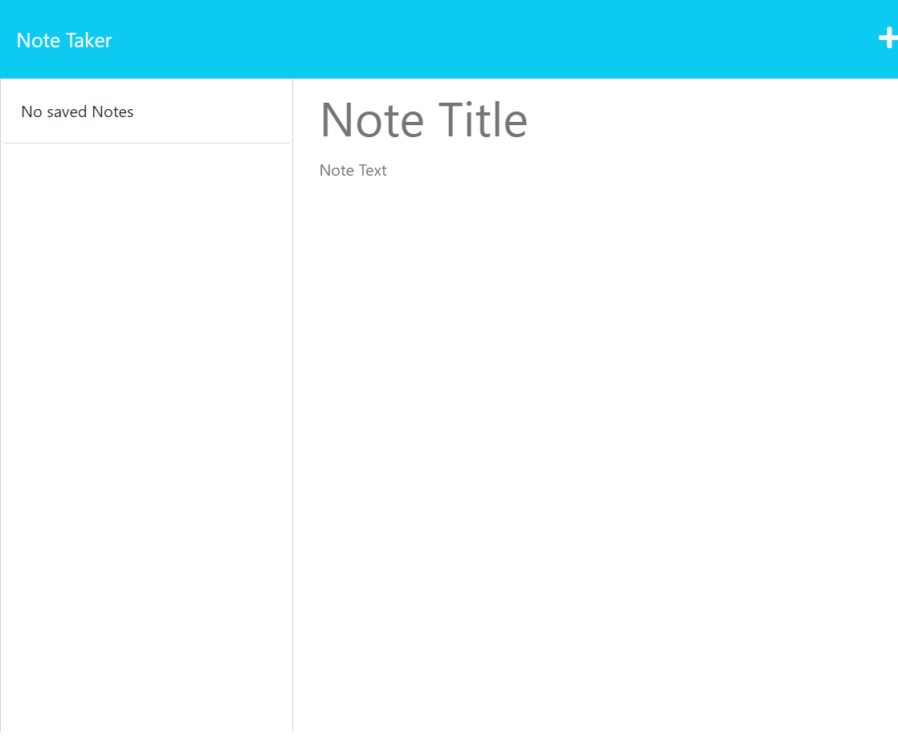

# Note Taker App

## Description

This project is to give people a place to write and save their notes in one place.

## Installation

N/A

## Usage

To add a note press the plus button in the top right corner. Then, give the note a title and enter text into "note text", and a save button will appear in the top right corner. When you press it the note will appear on the left side of the scree. To see the note click on it, and to delete the note click one the delete button to the right of the title of the note.

https://note-taker-app2.herokuapp.com/notes

## Credits

N/A

## License

N/A